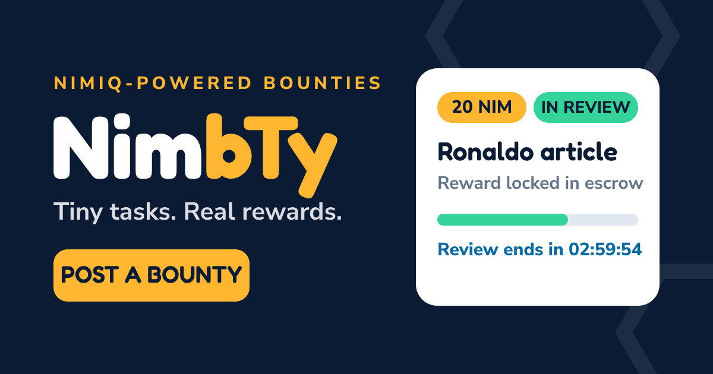

# NimbTy — Tiny tasks. Real rewards.

Put a bounty on anything that needs doing. NimbTy is a mobile-first micro-bounty
marketplace settled in real Nimiq payments: a creator funds the reward **before**
work begins, the reward locks in escrow, a worker claims it, submits proof, and
gets paid. No chasing payments, no disappearing clients.

Live: https://nimbty.vercel.app



Need something done? Fund it. See something you can do? Earn it.

## How it works

```
CREATE BOUNTY → FUND (real Nimiq tx, verified on-chain) → REWARD LOCKED → OPEN
  → WORKER CLAIMS → SUBMITS PROOF → CREATOR REVIEWS
      ├── APPROVE & PAY → worker paid from escrow
      ├── REQUEST REVISION → worker resubmits (still locked)
      ├── DISPUTE → locked until arbiter resolves
      └── NO ACTION before review expiry → auto-settles to the worker
```

- **No categories.** Just describe what needs doing: test a site, translate
  something, research, review, resize, check. Anything small and legitimate.
- **Money first.** A bounty goes OPEN only after the funding transaction is
  verified on-chain (recipient + exact amount + memo + block inclusion).
- **Protected submissions.** Workers can attach a final deliverable that stays
  locked until they are paid, even in disputes. Creators never get the work
  and the refund.
- **Real reputation.** Levels, streaks, approval rates and earnings all derive
  from on-chain-backed records. Nothing is hardcoded.
- **Built for Nimiq Pay.** Runs inside the Nimiq Pay mini-app browser:
  one-tap connect, one-tap fund and sign, no leaving the app.

## Tech

- **App:** Next.js 15 (App Router) + TypeScript, Tailwind, mobile-first
  (bottom nav: Home · Explore · Post · Work · Me), shareable bounty URLs
  (`/n/<id>`).
- **Data:** PostgreSQL + Prisma. A strict server-side state machine owns every
  bounty transition, the client can never post a status, and race-safe
  `updateMany` guards mean exactly one claimer and exactly one payout.
- **Money:** Nimiq testnet through a clean `PaymentService`
  (`verifyTransaction`, `releaseToWorker`, `refundCreator`). Funding is
  verified by hash against JSON-RPC; payouts are signed locally with the
  escrow key and relayed on-chain. Unverifiable money stays PENDING, never
  assumed, never faked.
- **Settlement:** outbox table + cron worker (`/api/cron/settle`). Review
  expiry auto-pays the worker; retries back off; jobs are idempotent so
  double-runs cannot double-pay.
- **Auth:** your wallet is your identity (signed challenge → httpOnly
  session). NimbTy never asks for seed phrases or private keys.

> Honest limitation: Nimiq L1 has no general-purpose escrow VM, so the MVP
> escrow is a dedicated testnet account whose every movement is audit-logged
> and can only result from validated state transitions. Only
> `PaymentService`'s release/refund paths move funds. Disputes resolve via a
> human arbiter endpoint in the MVP. See `architecture.md`.

## Run it locally

1. `npm install`
2. Start Postgres:
   `docker run -d --name nimbTy-db -e POSTGRES_PASSWORD=postgres -e POSTGRES_USER=postgres -e POSTGRES_DB=nimbTy -p 5432:5432 postgres:16`
3. `cp .env.example .env` and fill in the values below.
4. `npx prisma migrate deploy`
5. `npm run dev` → http://localhost:3000 (`npm run build` must stay green).

### Environment

| Variable | What it is |
|---|---|
| `DATABASE_URL` | Postgres connection string |
| `SESSION_SECRET` | Session signing secret (`openssl rand -hex 32`) |
| `CRON_SECRET` | Settle-cron shared secret (`openssl rand -hex 32`) |
| `ARBITER_KEY` | Dispute-resolution key (`openssl rand -hex 32`) |
| `NIMIQ_RPC_URL` | Nimiq testnet RPC, e.g. `https://rpc.testnet.nimiqwatch.com` |
| `ESCROW_ACCOUNT_ADDRESS` | Testnet escrow address (funds land here) |
| `ESCROW_ACCOUNT_PRIVATE_KEY` | Testnet escrow key (testnet only, never mainnet) |
| `NEXT_PUBLIC_APP_URL` | Public URL of the deployment |

## Try the money loop (testnet)

Post a bounty → FUND and POST → pay the escrow address with the exact amount
+ memo from any Nimiq wallet → I'VE PAID (server finds your tx) → BOUNTY
LIVE → a second wallet claims → submits → creator approves → escrow pays
out → profiles update. Full runbook in `handoff.md`.

## Deploy

Vercel Hobby: set the env vars above, build command
`prisma generate && prisma migrate deploy && next build`, daily cron backstop
plus a GitHub Actions 5-minute settle driver (see
`.github/workflows/settle.yml`). Details in `handoff.md`.

## Docs

- `prd.md` — product requirements and flows
- `architecture.md` — system design
- `project-plan.md` — phase status and verification log
- `handoff.md` — run, test and deploy runbook
- `memory.md` — key implementation decisions (incl. Nimiq SDK findings)

## Status

MVP live on testnet at https://nimbty.vercel.app with the full loop verified:
post → fund → claim → submit → review → settle → earn.

## License

MIT — see [LICENSE](LICENSE).
